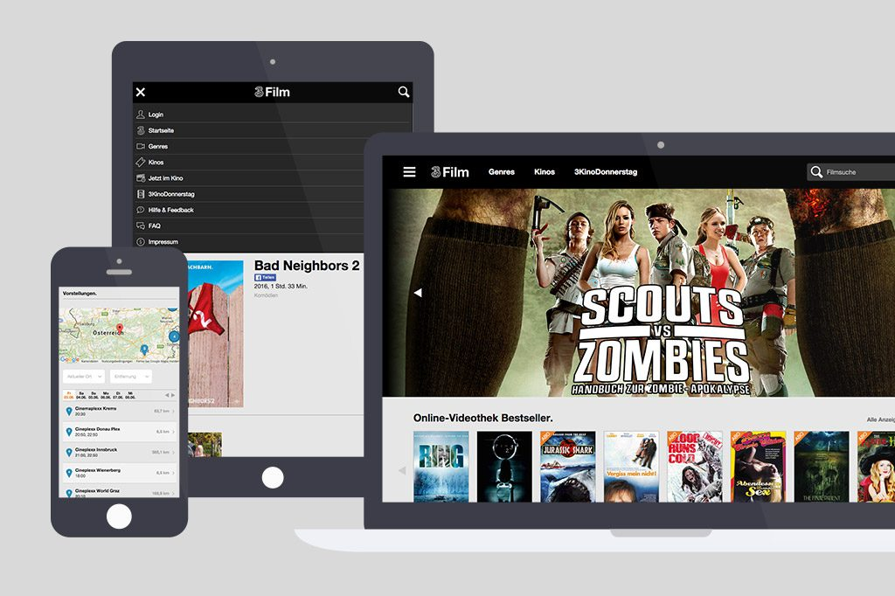
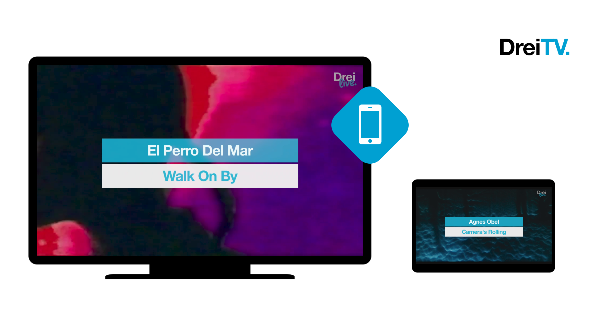

# Projektportfolio von Florian Bauer

## 3Film 
2015 - 2019

2015 hatte Drei eine eigene Video-App [3Film](https://www.drei.at/de/privat/produkte-und-services/drei-tv/drei-film.html) relauncht, welche eine Videothek und einen Kinoguide vereinte. 3Film konnte am Smartphone (Android, iOS), Tablet, TV (Google Chromecast) oder PC/Mac genutzt werden. Zu einem großen Teil wurde die App in der internen Produktentwicklung umgesetzt. 

**Meine Zuständigkeiten in der Rolle als IT Multimedia Products Engineer waren:**
- Technischer Austausch mit den Content-Partnern (Definition von Videospezifikationen) 
- Erstellen von Tests & Entwicklungsvorschläge für unser internes VIDEO CMS
- Backend-Tätigkeiten
	- Betreung der NAS-Server (Windows & Linux Server)
	- Automatisierung des Video-Encoding-Workflows (~ Re-Encoding von 3000 Filme)
	- Verwaltung der VOD-Datenbank (SQL)

**Tools:**
- [Cambria FTC](https://capellasystems.net/products/transcoding/cambria-ftc/)
- DRM-Videoverschlüsselung (CastLabs, DRMtoday) 
- SQL
- ffmpeg
- PHP
- Java (Operative Tätigkeiten bei z:b. der Fehlersuche)

## Drei TV / Drei Live
2016 - 2021

Bis 2021 hatte [Drei TV](https://www.drei.at/drei-tv) einen hauseigenen Musik- und Unterhaltungssender **Drei Live** im Portfolio. Dieser wurde ab 2016 technisch ingesourced und von mir
betreut.

**Meine Zuständigkeiten in der Rolle als IT Multimedia Products Engineer waren:**
- Auswahl und Inbetriebnahme eines Video Playout Systems
- Betreuung des Videoservers
- Automatisierung der Playlistenerstellungen für einen 24h Betrieb
- Optimierung von Video-Encoding-Workflows

**Verwendete Tools:**
- ffmpeg: Video-Encoding
- PHP: Automatisierung der Workflows
- [Stryme GENESIX](https://www.stryme.com/genesix/): Video Playout System

## Animierte Erklärvideos & Produktvideos
2019 - 2022

Im Rahmen meiner Tätigkeit als interner Videoproduzent wurden der Bedarf an leicht verständlichen animierten Erklärvideos zu Produkten (extern) oder internen Projekte immer größer. Eine kleine Auswahl dieser Projekte findet man unter [folgendem Vimeo-Showcase-Link](vimeo.com/user/5284132/folder/10654204).

**Meine Zuständigkeiten in der Rolle als Video Producer waren:**
- Inhaltliche Abstimmungen und Konzeption mit den Fachabteilungen & Kunden
- Animation / Motion-Design
- Ton
- Schnitt
- Distribution (Intranet, Social Media)

**Tools:**
- Adobe After Effects 
- Automatisierung des Adobe After Effects Workflows mit Adobe ExtendScript
- Adobe Audition
- Adobe Premiere Pro

Ein Einblick in das [gesamte Portfolio der Videoproduktionen bei Drei.](https://vimeo.com/711808318/523d2ca1c6)

  
